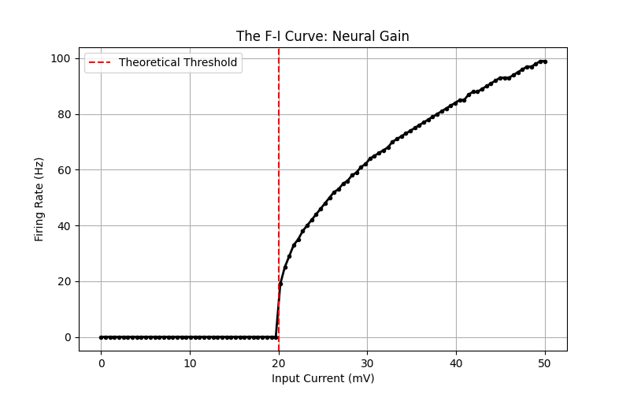
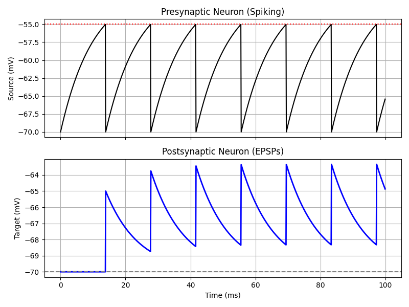
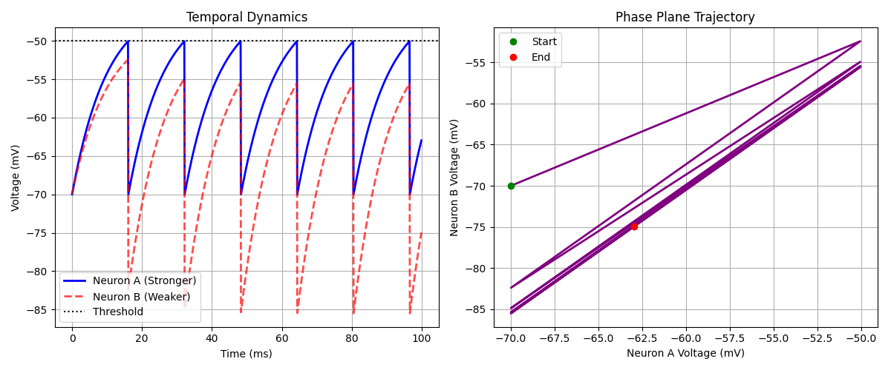
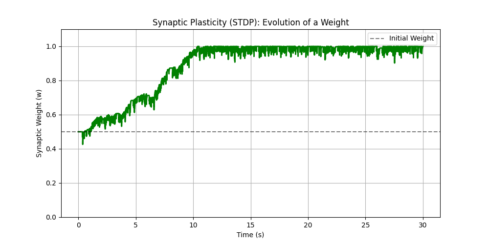
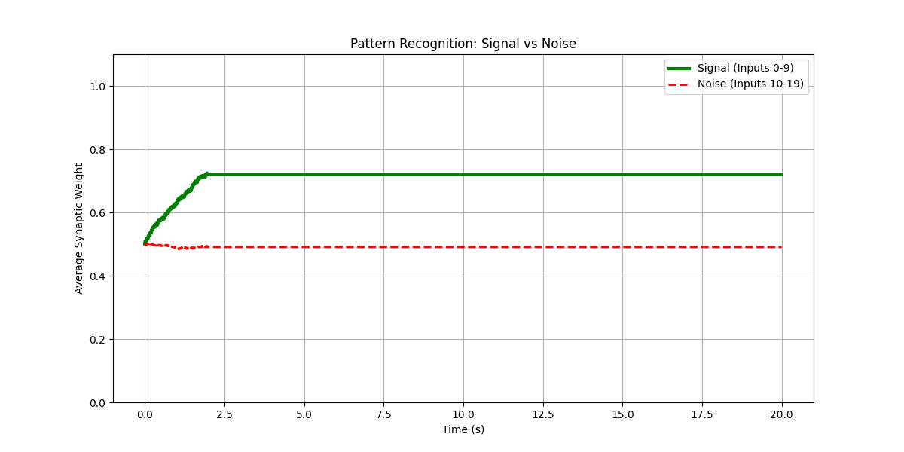
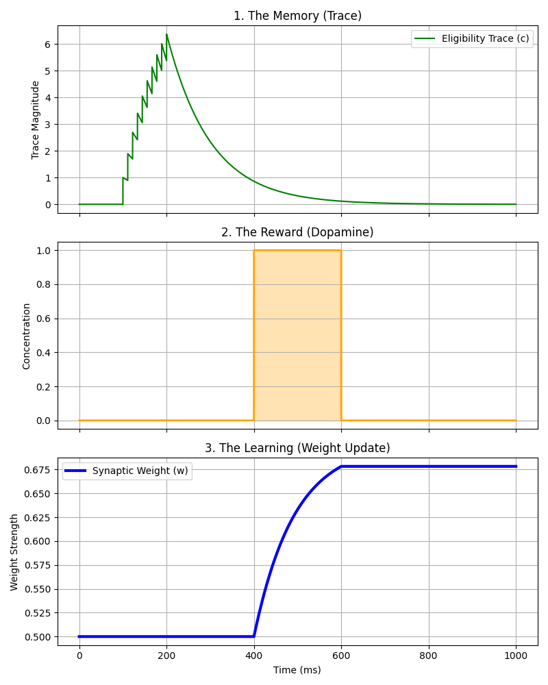
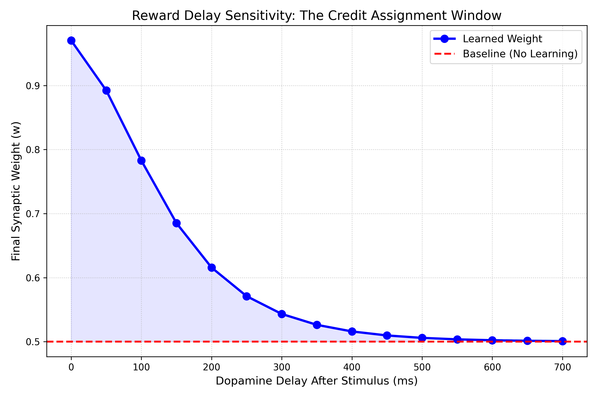

# Brian2-Modeling-Experiments
Simulating dynamical systems in Computational Neuroscience using Brian2. Investigating neuronal dynamics, population coding, and emergent network behavior

**Tools:** Python, Brian2, Matplotlib, Numpy 
---

## Experiment 1: The F-I Curve (Neural Gain)
**Objective:** Characterize how a Leaky Integrate-and-Fire (LIF) neuron translates input current (I) into firing frequency (F).

* **Method:** Vectorized simulation of 100 neurons with increasing input currents (0mV-50mV).
* **Key Result:** The neuron exhibits a clear **Rheobase (Threshold)** at 20mV. Below this input, the cell is silent. Above it, the firing rate increases logarithmically, capped by the refractory period.

**Resulting Plot:**

---
## Experiment 2: Synaptic Transmission (The EPSP)
**Objective:** Model the transmission of chemical signals between a "Source" neuron and a "Target" neuron.

* **Mechanism:** A pre-synaptic spike triggers an instantaneous increase in post synaptic voltage (`v_post += 5*mV`).
* **Key Result:** Observe **Temporal Summation**. The Target neuron integrates incoming spikes. Since the input frequency is high, the voltage "staircases" upward because the membrane potential does not fully decay between inputs.

**Resulting Plot:**

---
## Experiment 3: Decision Making (Winner-Take-All)
**Objective:** Model how a neural network resolves conflict between two competing inputs using **lateral inhibition**.

* **Method:** Two neurons inhibit each other via mutual inhibitory synapses (`v_post -= 30 mV`). Neuron A receives a slightly stronger constant input than Neuron B, representing asymmetric evidence.
* **Analysis:** Utilize **phase-plane analysis** (plotting $V_A$ vs $V_B$) to visualize the system’s trajectory toward a **decision attractor**.
* **Key Result:** Despite both inputs being suprathreshold, the network converges to a single winner. Neuron A fires first and completely suppresses Neuron B, demonstrating **WTA**, race-to-threshold behavior, and neural contrast enhancement.

**Resulting Plot:**

---
## Experiment 4: Synaptic Learning (STDP)
**Objective:** Model biological learning using **Spike-Timing Dependent Plasticity (STDP)**. The synapse self adjusts its strength based on the precise timing of spikes. We replace the static synapse with a dynamic differential equation.

* **LTP (Strengthening):** If Pre-spike $\to$ Post-spike (causal), increase weight ($w$).
* **LTD (Weakening):** If Post-spike $\to$ Pre-spike (acausal), decrease weight ($w$).

**Resulting Plot:**

---
## Experiment 5: Pattern Recognition (Signal vs Noise)
**Objective:** Test whether a single spiking neuron using STDP can automatically detect temporally correlated inputs embedded within random noise.

### The Setup
* **Neuron:** 1 postsynaptic LIF neuron.
* **Inputs:** 20 presynaptic channels.
    * **Signal (0–9):** Fire synchronously every 50 ms (Correlated).
    * **Noise (10–19):** Fire randomly (Uncorrelated).

### The Logic (Hebbian Learning)
Same as experiment 4.
* **Pre $\to$ Post:** Potentiation (LTP).
* **Post $\to$ Pre:** Depression (LTD).
* **Hypothesis:** Correlated inputs should strengthen (cause spikes), while random inputs should remain weak or decay.

### The Result
* **Signal Weights (Green):** Increased from 0.5 to **~0.75** (Selective Strengthening).
* **Noise Weights (Red):** Remained near baseline **~0.50** (No significant correlation).
* **Stability:** Learning stabilized after ~2–3 seconds.

### Interpretation
The neuron selectively strengthened synapses that consistently preceded its firing. This demonstrates:
1.  **Correlation Detection:** The neuron found the hidden pattern.
2.  **Competitive Learning:** The signal inputs "won" control over the neuron's firing.
3.  **Emergent Selectivity:** STDP alone is sufficient for a neuron to ignore uninformative noise without supervision.

**Resulting Plot:**

---
## Experiment 6: Reinforcement Learning with Eligibility Traces
**Objective:** Demonstrate distal reward learning using a biologically plausible 3 factor learning rule (pre-synaptic activity, post-synaptic activity, and neuromodulatory signal) to address the temporal credit assignment problem.

### The Learning Mechanism (Dopamine-Gated Plasticity)
Classical pair-based STDP updates synapses at spike timing and does not inherently account for delayed reinforcement signals. To overcome this limitation, we separate synaptic eligibility from weight consolidation. This constitutes a three-factor learning rule, where synaptic change depends on (1) pre/post activity, (2) a synaptic eligibility trace, and (3) a global neuromodulatory signal.

**1. Eligibility Trace ($c$)**
Each presynaptic spike leaves a decaying trace:
$$\frac{dc}{dt} = -\frac{c}{\tau_c}$$
This trace represents a temporary memory of recent synaptic activity.

**2. Dopamine-Gated Update**
The synaptic weight evolves according to:
$$\frac{dw}{dt} = \eta \, c \, D \, (w_{max} - w) w$$

Where:
* $D$ is the dopamine reward signal.
* $\eta$ is the learning rate.
* $(w_{max} - w)w$ ensures multiplicative soft bounds in the range $[0, 1]$.

Thus, weight changes occur only when dopamine overlaps with a non-zero eligibility trace.

### Key Result
* **During stimulus presentation:** eligibility trace rises.
* **During delay:** trace decays exponentially.
* **When dopamine arrives:** weight increases proportionally to the remaining trace.
* **After dopamine ends:** Learning stops.

This demonstrates delayed reinforcement learning through a biologically plausible 3 factor rule.

**Resulting Plot:**

---
## Experiment 7: Quantifying the Credit Assignment Window (Delay Sweep)
**Objective:** Measure how synaptic learning strength depends on the temporal delay between stimulus and reward.

### Experimental Design
A parameter sweep was conducted over 15 trials:
1. Stimulus induces eligibility trace formation.
2. A variable delay (0–700 ms) is introduced.
3. Dopamine reward is applied.
4. Final synaptic weight is recorded.

*The simulation is reset between trials to ensure independent measurements.*

### Results
Because the eligibility trace decays exponentially:
$$c(t) = c_0 e^{-t/\tau_c}$$
The effective reinforcement signal $c(t_{delay})D$ decreases as reward delay increases. The final weight exhibits a clear exponential dependence on reward delay:
* **0 ms delay:** strong potentiation ($w \approx 0.97$)
* **150 ms delay:** moderate learning ($w \approx 0.68$)
* **>500 ms delay:** minimal learning ($w \approx 0.50$)

Learning effectively vanishes once the delay exceeds $\approx 3\tau_c$, consistent with theoretical predictions.

### Interpretation
The temporal extent of reinforcement learning is governed by the eligibility trace time constant $\tau_c$. This experiment quantitatively demonstrates how synaptic eligibility traces define a finite temporal window for reinforcement, thereby providing a mechanistic solution to the temporal credit assignment problem.

**Resulting Plot:**

---
Together, experiments 6 & 7 demonstrate that reinforcement learning in spiking networks emerges from the interaction between transient synaptic eligibility and temporally precise neuromodulatory signaling.

---
